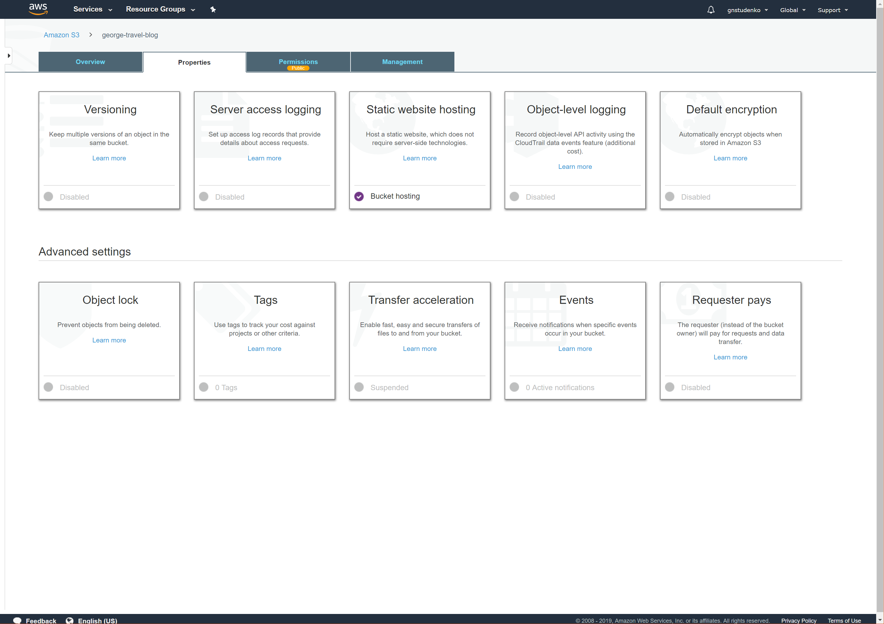

# AWS-Static-Website
An static website deployed to AWS 

The website was published using:
* AWS S3 service for hosting the files
* CloudFront for faster distribution

## Live Website 
Cloudfront URL: 
https://dobdujqi0dm9g.cloudfront.net

Direct S3 Bucket: 
http://george-travel-blog.s3-website.eu-west-3.amazonaws.com/ 

## AWS S3 Bucket configuration

### S3 Bucket configuration

Created the george-travel-blog S3 Bucket

Uploaded the website static files

S3 Bucket Public Access Configuration

Set the Bucket Policy

Enable Static website hosting property

S3 Static Website Document Index document configuration

### CloudFront configuration

Cloudfront Distributions

CloudFront Configurations

CloudFront Origins configuration